<!-- ===================== HEADER ===================== -->

  

  

  
  
  
  <!-- LeetCode & Codeforces badges (hidden for now)
  
  
  -->

 

<!-- ===================== ABOUT ===================== -->

## Hi, I'm Omar 

I'm a **product engineer** from Alexandria, Egypt, and I like owning a product from the first commit to the app store listing. I started out writing the frontend for Blokkah, built **Ayid AI** for real estate end to end, and today I run the company as General Manager while leading product delivery for clients at ROAR KSA.

-  **General Manager @ [Blokkah](https://blokkah.app)**: real estate tech in Saudi Arabia (web, iOS, Android)
-  **Product Owner @ ROAR KSA**: ~39 products across delivery, ~10 launched, a team of ~20
-  **Computer & Communications Engineering @ Alexandria University**
-  **Computer vision roots**: trained YOLO models for an award-winning underwater ROV
-  **Ask me about** React & Next.js, shipping MVPs, or turning a client brief into a roadmap
-  **Reach me at** omar.roushdy@outlook.com
-  **Fun fact:** I won 1st place in the Egypt Math Olympiad (Alex-patch) in 2018

 

<!-- ===================== PRODUCTS ===================== -->
##  What I'm building

| | Product | What it is | My role |
|:-:|---|---|---|
|  | **[Blokkah](https://blokkah.app)** | Real estate platform for property search and listings, with apps on the App Store & Google Play | Built the web frontend; now lead the backend, mobile & dashboard teams as GM |
|  | **Ayid AI** | Full-stack AI solution for real estate | Designed and built it myself, frontend and backend |
|  | **[Khatem](https://khatem.sa)** | Quran reading for individuals and groups, on web, iOS & Android | Built the web frontend; directed backend & mobile through launch |
|  | **[Blokktech](https://blokktech.com)** | Blokktech's company website | Coded the whole site |
|  | **[Taled](https://taled.net)** | E-commerce store on Salla | Built the storefront and improved its search rankings |

<!-- ===================== TECH STACK ===================== -->
##  Tech stack

<table>
  <tr>
    <td align="center" width="150"><b>Frontend</b></td>
    <td></td>
  </tr>
  <tr>
    <td align="center"><b>Backend & Cloud</b></td>
    <td></td>
  </tr>
  <tr>
    <td align="center"><b>Languages</b></td>
    <td></td>
  </tr>
  <tr>
    <td align="center"><b>AI & Vision</b></td>
    <td>
      
      
      
      
      
    </td>
  </tr>
  <tr>
    <td align="center"><b>Tools & Design</b></td>
    <td></td>
  </tr>
  <tr>
    <td align="center"><b>Product & Delivery</b></td>
    <td>
      
      
      
      
    </td>
  </tr>
</table>

<!-- ===================== ACHIEVEMENTS & COMMUNITY ===================== -->
<table>
<tr>
<td valign="top" width="50%">

###  Achievements

- **1st Place, ROV Senior Category**: Global Robotics Challenge (Go Dive Derby) with Team Torpedo ROV. I was co-pilot, built the control GUI, and trained YOLO models for real-time underwater vision.
- **Best Software Project & Team Leader Awards**: Digital Egypt Pioneers Initiative (DEPI)
- **3rd Place, NASA Space Apps 2024**: GLOBE Protocol Games challenge

</td>
<td valign="top" width="50%">

###  Community

- **Technical Head**, NASA Space Apps Alexandria (2025–26)
- **Technical Coordinator & Frontend Instructor**, AAST (2026): taught frontend in a web, mobile & soft-skills bootcamp built around NASA Space Apps challenges
- **PR Head**, ACM Alexandria Student Chapter (2025–26)

</td>
</tr>
</table>

<!-- ===================== GITHUB STATS ===================== -->
##  GitHub activity

  

  
  

<!-- PROBLEM SOLVING section (hidden for now, delete this line and the closing marker below to show it)
##  Problem solving

  
  

-->

<!-- ===================== CONTRIBUTION SNAKE ===================== -->
##  Contributions

<picture>
  <source media="(prefers-color-scheme: dark)" srcset="https://raw.githubusercontent.com/0maroushdy/0maroushdy/output/snake-dark.svg" />
  <source media="(prefers-color-scheme: light)" srcset="https://raw.githubusercontent.com/0maroushdy/0maroushdy/output/snake-light.svg" />
  
</picture>

<!-- ===================== FOOTER ===================== -->

  

